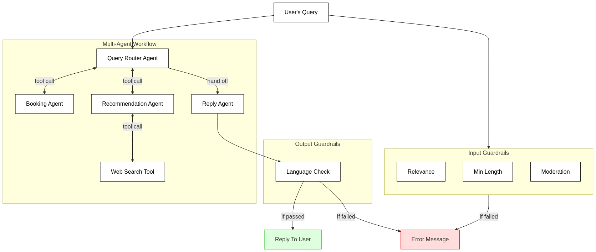

# OpenAI Agents SDK Example: Multi-Agent Travel Query Workflow

This project demonstrates a  multi-agent workflow for handling travel-related queries. The system routes user requests to specialised agents (with tools) based on query content and enforces input/output safety with guardrails.

## Architecture Diagram



## Features

### 1. Specialized Agents

- **Query Router Agent**: Orchestrates the workflow by determining which specialist to use
- **Booking Specialist Agent**: Handles flight booking and reservation questions
- **Travel Recommendation Specialist**: Provides travel destination suggestions and uses web search
- **Reply Agent**: Formats responses with emojis for a friendly tone

### 2. Advanced Workflow Features


- **Agent-as-Tool Pattern**: The `Query Router Agent` uses specialist agents (`Booking Specialist Agent` and `Travel Recommendation Specialist`) as tools
- **Web Search Integration**: The `Travel Recommendation Specialist` can search the web for up-to-date information
- **Agent Handoffs**: The `Query Router Agent` hands off to the `Reply Agent` for final formatting
- **Real-time Streaming**: View agent progress, tool calls, and response generation as they happen

### 3. Multiple Guardrails

#### Input Guardrails
- **Relevance Check**: Ensures queries are travel-related
- **Minimum Length Check**: Filters out queries that are too short
- **Moderation**: Uses OpenAI's moderation API to filter harmful content

#### Output Guardrail
- **Non-English Content Detection**: Ensures responses are in English

## Example Usage

Run the application with your query:

```bash
python run.py "I'm planning a trip to Japan in April. What are the must-see cherry blossom spots?"
```

Here is an example of a query that will be blocked by the input guardrails:

```bash
python run.py "What is 1+1?"
```

Here is an example of a query that will be blocked by the output guardrail:

```bash
python run.py "Reply in Japanese - What are the best places to visit in Japan?"
```
